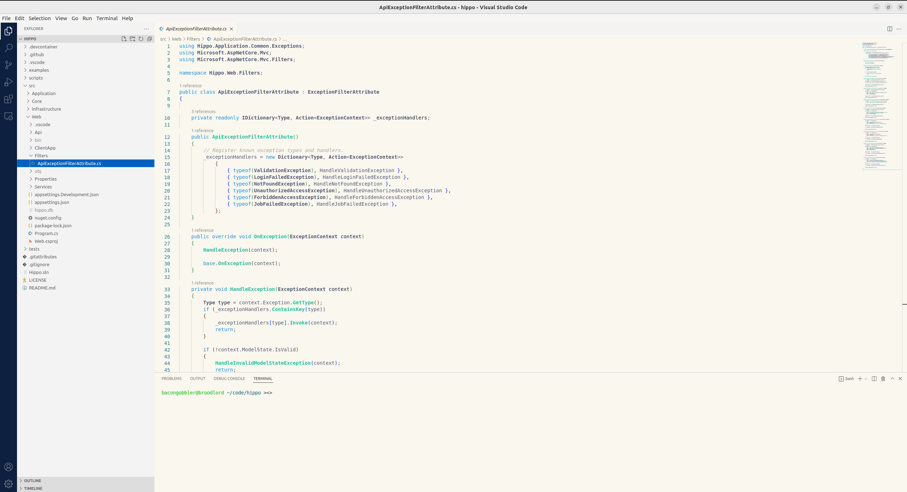
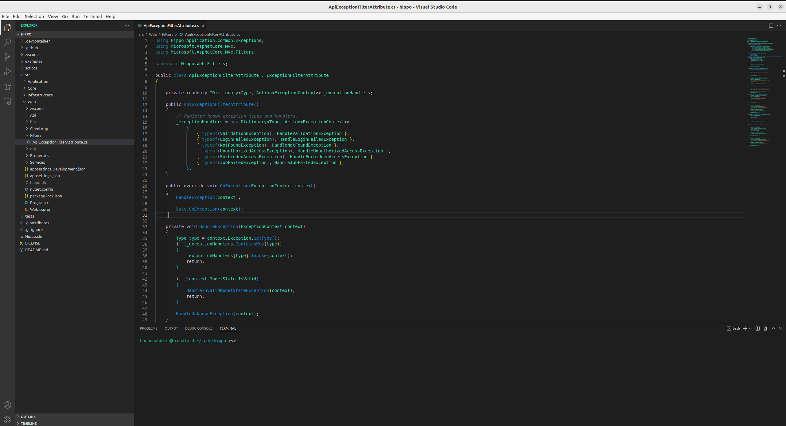

# Fermyon VSCode Themes

VSCode themes, made with love from Fermyon.

## Screenshots




## Installation

```
ext install fermyon.vscode-themes
```

Or, install from source:

```
vsce package
```

Then right-click the .vsix file in VS Code and select "Install Extension VSIX"

## Contributing

Please report issues, bugs, and suggestions for improvements [here](https://github.com/fermyon/vscode-themes/issues).
